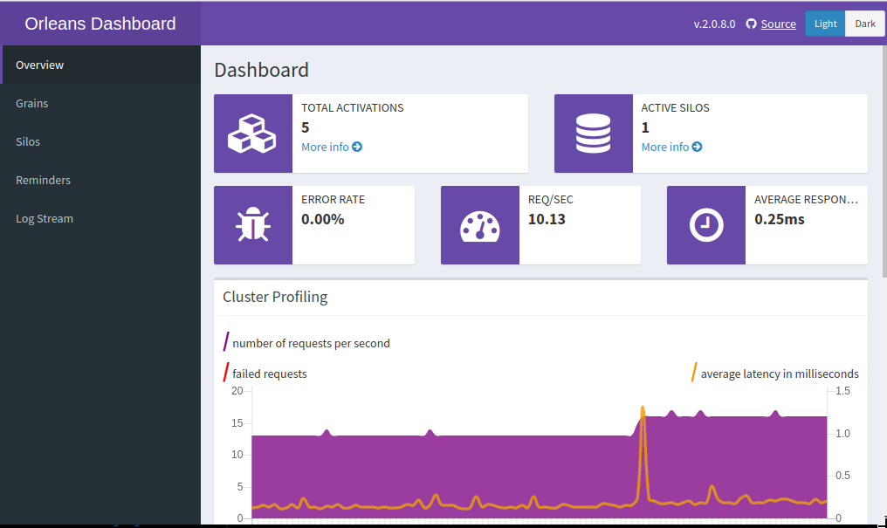
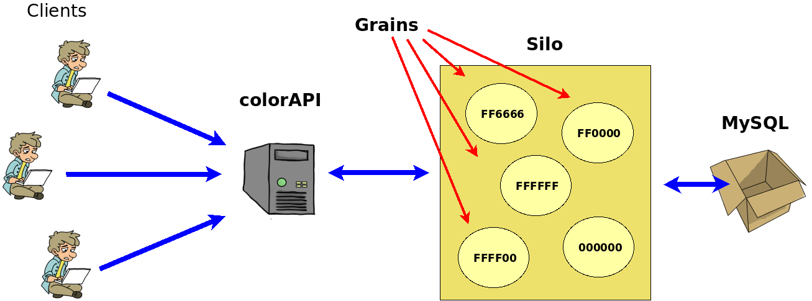
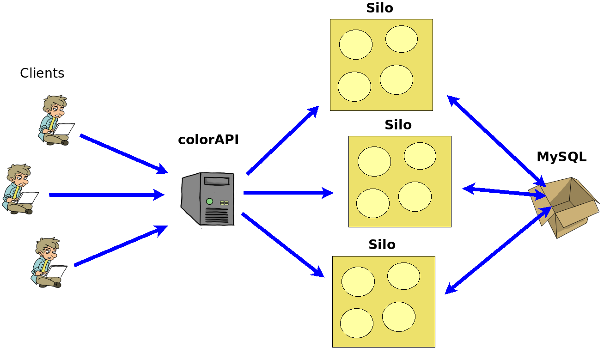

# API de traduccions dels colors

La idea és desenvolupar una API en Net Core fent servir un sistema d'actors. En concret [Orleans](https://dotnet.github.io/orleans/index.html). Sembla que és semblant a Akka però més senzill.

Els avantatges dels sistemes d'actors és que simplifiquen la concurrència, són fàcilment escalables i etc... Millor que en mireu els avantatges a la seva web ;-)

He activat el Dashboard per defecte. S'hi accedeix amb http://localhost:8080:



## Què he fet?

El que hi ha implementat és un sistema de traducció del codi RGB als diferents idiomes ... (ho sé, fa plorar).

L'arquitectura resultat és aquesta. Especialment interessant en aquest sistema és la forma com es gestionen els actors (grains)



La idea és que quan algú demani per un codi RGB li digui quin és el nom que té aquest color en diferents idiomes

    FF0000 -> català: vermell, castellà: rojo, anglès: red

El sistema persisteix automàticament les dades que se li entren en una base de dades MySQL de manera que sobreviu a les aturades del servei.

He fet servir MySQL de backend però n'hi ha molts més (Tant SQL com en el núvol, ...): SQL Server, Oracle, PostgreSQL, Azure DB, DynamoDB.

Tot i que només faig servir un sol Silo es pot crear un cluster de Silos per escalar l'aplicació, tenir tolerància a fallades, ...



El sistema d'actors té una sèrie d'avantatges sobre l'arquitectura tradicional de tres capes ([llegiu-vos-ho vosaltres mateixos](https://dotnet.github.io/orleans/Documentation/Introduction.html) ;-) )

## Iniciar el programa

El programa necessita un sistema gestor de base de dades en marxa, que s'hi hagin creat les taules pertinents (que estan en scripts en la carpeta **OrleansAdoNetContent** del projecte **Silo**)

> La configuració de la base de dades està en un ConnectionString al fitxer **Program.cs** del projecte **Silo**. Algun dia ho milloraré :-P

Primer s'inicia el Silo:

    cd Silo
    dotnet run

I després l'API

    cd colorsAPI
    dotnet run

## Funcionament

> Faig les demostracions amb [httpie](https://httpie.org/)

Es poden veure les traduccions d'un color enviant un GET a /api/color/xxx (on xxx és el codi RGB en hexadecimal)

    http --verify=no  https://localhost:5001/api/colors/FFFF00

La resposta serà un document JSON amb les traduccions que hi hagi

    HTTP/1.1 200 OK
    Content-Type: application/json; charset=utf-8
    Date: Mon, 20 Aug 2018 17:58:19 GMT
    Server: Kestrel
    Transfer-Encoding: chunked

    {
        "id": "FFFF00",
        "translations": [
            {
                "language": "catalan",
                "translation": "groc"
            },
            {
                "language": "spanish",
                "translation": "amarillo"
            },
            {
                "language": "english",
                "translation": "yellow"
            },
            {
                "language": "french",
                "translation": "jaune"
            }
        ]

Si el color no té cap traducció tornarà el document sense res a l'array 'translations':

    HTTP/1.1 200 OK
    Content-Type: application/json; charset=utf-8
    Date: Mon, 20 Aug 2018 18:17:36 GMT
    Server: Kestrel
    Transfer-Encoding: chunked

    {
        "id": "000000",
        "translations": []
    }

També dóna error si es passa alguna cosa que no sigui un codi RGB ...

    HTTP/1.1 400 Bad Request
    Content-Type: application/json; charset=utf-8
    Date: Mon, 20 Aug 2018 20:27:24 GMT
    Server: Kestrel
    Transfer-Encoding: chunked

    {
        "message": "Incorrect RGB Code"
    }

Es pot enviar una nova traducció al sistema enviant un POST amb l'Id del color com a paràmetre i les dades de la traducció en el cos del missatge en format JSON

    http --verify=no  post https://localhost:5001/api/colors/FFFF00 Language="french" Translation="jaune"

Això envia de contingut una document JSON com aquest:

```json
{
  "language": "french",
  "translation": "jaune"
}
```

Si tot ha anat bé el sistema contesta amb un 200 Ok

    HTTP/1.1 200 OK
    Content-Type: application/json; charset=utf-8
    Date: Mon, 20 Aug 2018 20:22:33 GMT
    Server: Kestrel
    Transfer-Encoding: chunked

    {
        "message": "Translation added"
    }

També es pot modificar la traducció d'un idioma amb el mètode PUT (es canvia la traducció que coinicideixi amb el valor de _language_.

    http --verify=no  put https://localhost:5001/api/colors/FFFF00 Language="french" Translation="jaune"

La opció d'esborrar és més o menys el mateix. S'envia DELETE i el que es vol esborrar

    http --verify=no  delete https://localhost:5001/api/colors/FFFF00/french

o bé esborrar-ho tot

    http --verify=no  delete https://localhost:5001/api/colors/FFFF00

Espectacular oi?

No gaire, però l'avantatge del sitema és que es pot escalar molt més fàcilment que un sistema tradicional creant clusters de Silos, etc... (llegiu la documentació)

## API

Les peticions implementades són:

| URL                              | Mètode                                   |
| -------------------------------- | ---------------------------------------- |
| GET /api/color/ff0000            | Obtenir les traduccions de FF0000        |
| POST /api/color/ff0000           | Afegir una traducció de FF0000           |
| PUT /api/color/ff0000            | Modificar una traducció de FF0000        |
| DELETE /api/color/ff0000         | Eliminar totes les traduccions de FF0000 |
| DELETE /api/color/ff0000/spanish | Eliminar la traducció spanish de FF0000  |
